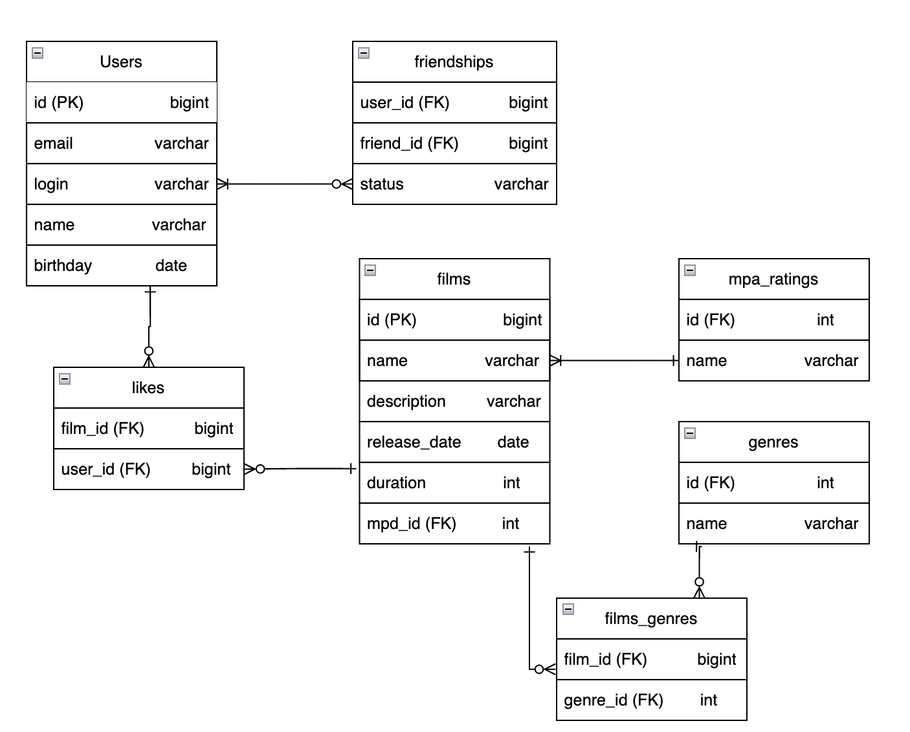

# Filmorate

## Описание проекта

Filmorate — это приложение для работы с фильмами и пользователями.

---

## Схема базы данных


---

##  Основные таблицы

### users

Хранит информацию о пользователях

* id — идентификатор
* email — email пользователя
* login — логин
* name — имя
* birthday — дата рождения

---

### films

Хранит информацию о фильмах

* id — идентификатор
* name — название
* description — описание
* release_date — дата релиза
* duration — продолжительность
* mpa_id — ссылка на рейтинг Ассоциации кинокомпаний

---

### mpa_ratings

Справочник возрастных рейтингов

* G
* PG
* PG-13
* R
* NC-17

---

### genres

Справочник жанров

* COMEDY
* DRAMA
* CARTOON
* THRILLER
* DOCUMENTARY
* ACTION

---

### film_genres

Связь фильмов и жанров (many-to-many)

---

### likes

Хранит лайки пользователей фильмам

---

### friendships

Хранит дружбу пользователей

* status:
    * UNCONFIRMED — заявка в друзья
    * CONFIRMED — подтверждённая дружба

---

## Связи между таблицами

* films → mpa_ratings — многие к одному 
* films ↔ genres — многие ко многим (через film_genres)
* users ↔ films — многие ко многим (через likes)
* users ↔ users — многие ко многим (через friendships)

---

## Примеры SQL-запросов

### Получить все фильмы

```sql
SELECT * FROM films;
```

---

### Получить фильм с жанрами

```sql
SELECT f.*, g.name
FROM films f
LEFT JOIN film_genres fg ON f.id = fg.film_id
LEFT JOIN genres g ON fg.genre_id = g.id
WHERE f.id = ?;
```

---

### Топ N популярных фильмов

```sql
SELECT f.*, COUNT(l.user_id) AS likes_count
FROM films f
LEFT JOIN likes l ON f.id = l.film_id
GROUP BY f.id
ORDER BY likes_count DESC
LIMIT ?;
```

---

### Получить друзей пользователя

```sql
SELECT u.*
FROM users u
JOIN friendships f ON u.id = f.friend_id
WHERE f.user_id = ?
  AND f.status = 'CONFIRMED';
```

---

### Получить общих друзей

```sql
SELECT u.*
FROM users u
JOIN friendships f1 ON u.id = f1.friend_id
JOIN friendships f2 ON u.id = f2.friend_id
WHERE f1.user_id = ?
  AND f2.user_id = ?
  AND f1.status = 'CONFIRMED'
  AND f2.status = 'CONFIRMED';
```

---

### Получить всех пользователей, которые лайкнули фильм

```sql
SELECT u.*
FROM users u
         JOIN likes l ON u.id = l.user_id
WHERE l.film_id = ?;
```

---

### Получить фильмы, которые лайкнул пользователь

```sql
SELECT f.*
FROM films f
         JOIN likes l ON f.id = l.film_id
WHERE l.user_id = ?;
```

---